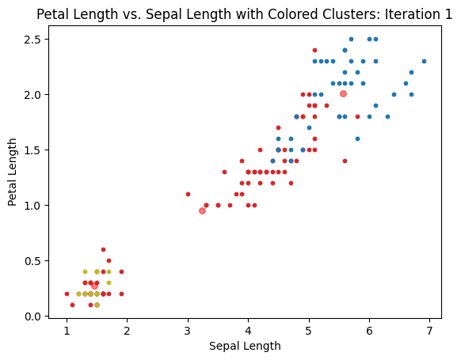
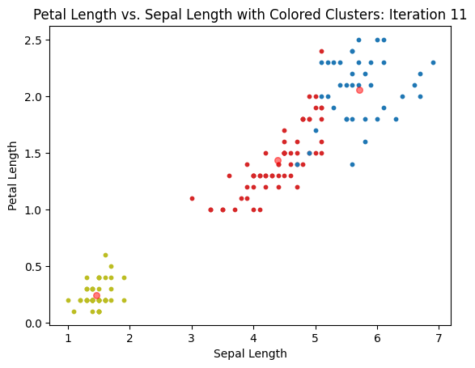
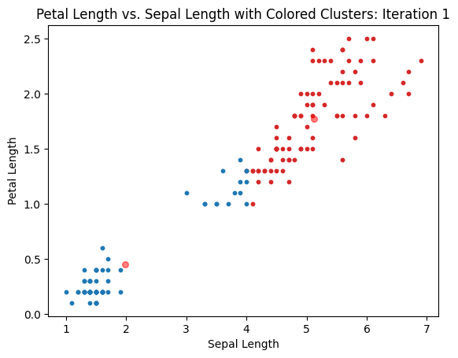

# csds391-pa2

Repository for PA2 of CSDS391 (AI)

## Set up instructions

1. Text here.

## Write-up

### Code Design

Text here.

### Clustering

(A) Implement k-mean clustering with the objective function and learning rule from WA4-Q1.

Done. See the code in "KMeansClustering.py"

(B) Plot the value of the objective function as a function of the iteration to show that the learning rule and implementation minimizes the following expression.

$$ D = \sum_{n=1}^N\sum_{k=1}^N{r_{n,k} || x_n - \mu_k ||^2} $$

(C) Plot the results of the learning process by showing the initial, intermediate, and converged cluster centers overlaid on the data for $ k = 2 $ and $ k = 3 $.

See figures below for the convergence when $ k = 3 $

See figures below for the convergence when $ k = 2 $

(D) Devise a method to plot the decision boundaries for the dataset using the optimized parameters.

### Neural Networks

(A) Write a program to calculate the MSE of the data for a simple one-layer neural network using a sigmoid non-linearity.

(B) Compute the MSE for two different settings of the weights. Hand-select these weights to give large and small errors. Plot both boundaries on the dataset.

(C) Give a mathematical derivation of the gradient of the objective function with respect to the weights. Use $ w_0 $ to represent the bias term. Show and explain each step.

(D) Show how the gradient can be written in both scalar and vector form.

(E) Write code that computes the summed gradient for an ensemble of patterns. Illustrate the gradient by showing how the decision boundary changes for a small step.

## Work Log

1. Set up the project

    I created the basic file structure, created empty files, and read through the instructions.

2. Figure out what to do

    I re-read the instructions and consulted my friends who have started the project.

3. Import and parse the data

    I created a class (IrisData) that reads the data in the "iris.data" file and parses it. It stores the data in a 2D array.

4. Review the k-means clustering algorithm so that I can implement it.

    Still WIP as of 04-15-2023. I am also consulting [Rohan's work](https://github.com/Rohan-s18/Artificial_Intelligence/tree/main/AI-based%20implementations/Iris%20classification) as reference material.

5. Outline the class that will do k-means clustering

    I added a basic outline with the objective function, and cluster updates. The class still doesn't have a stopping mechanism except for the maxIter parameter, but I'm going to move ahead with visualization so that I can see where my code is at.

6. Add visualization of k-means

    I added visualization of the objection function decreasing and a scatter plot of the clusters. Using this, I was able to debug the code.

7. Add what I can to the write up for k-means

    Done. I will have to save part D for another time.

8. Figure out what to do for Neural Networks
